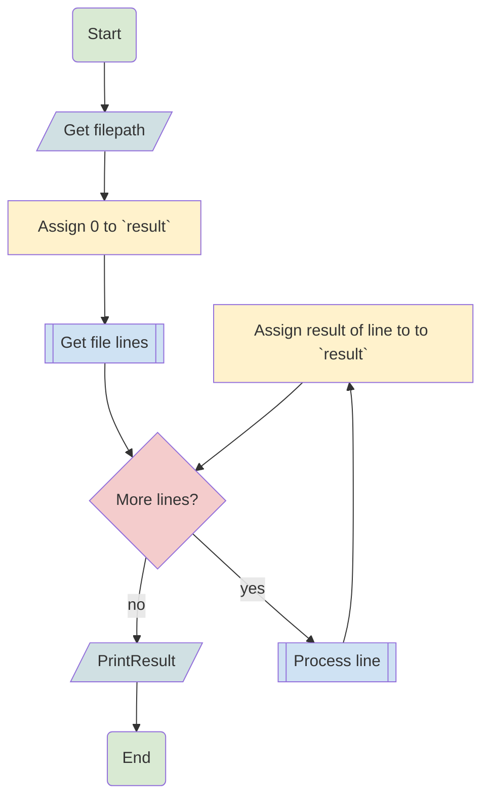

# ICS - Lesson 14 - Recap

In this lesson we will work on small steps solving programming exercises that
will eventually lead us to solve a bigger problem

## Program description

Write a program that takes as an input the path to a CSV file.
The CSV file will have 2 columns, `operator` and `operand`

The content of the `operation` can be one of the following

- `MULTIPLY`
- `DIVIDE`
- `SUM`
- `SUBTRACT`

The `operand` column will always represent a number.
The program should have an internal variable named `result` with an initial
value of `0`.

The program should read the file line by line and execute the corresponding
operation, assigning the result of this operation to the `result` variable

After processing the whole file the program should print the final `result`

Example:

Given a CSV file with the following content:

```csv
SUM,1
MULTIPLY,4
DIVIDE,2
SUBTRACT,1
```

The program should print the value of `1.0`

```sh
$ python main.py csvs/file1.csv
1.0
```

## Flowchart




## Exercises

- [Exercise 1](./exercises/exercise_1.py)
- [Exercise 2](./exercises/exercise_2.py)
- [Exercise 3](./exercises/exercise_3.py)
- [Exercise 4](./exercises/exercise_4.py)
- [Exercise 5](./exercises/exercise_5.py)
